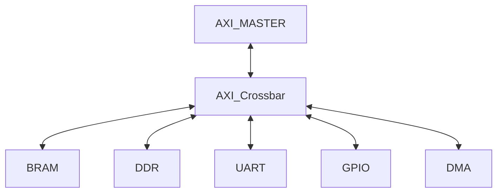
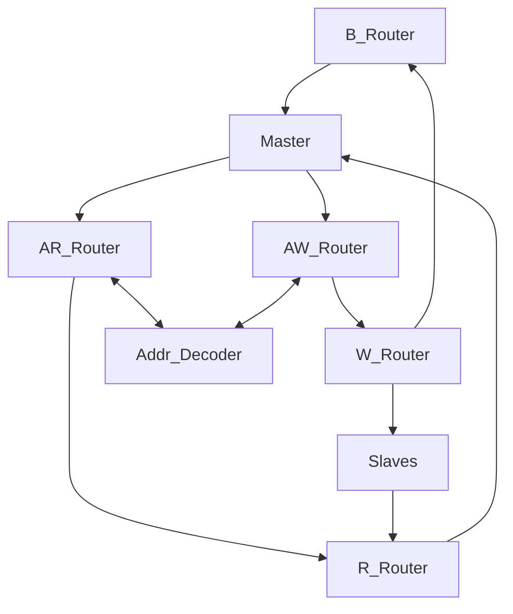

# SOC Plan
Using AXI4 spec: https://www.arm.com/architecture/system-architectures/amba/amba-specifications

## Top Level Diagram

## AXI Master
Using open source Vex Risc-V core: https://github.com/SpinalHDL/VexRiscv?tab=readme-ov-file#running-linux

## AXI Crossbar

### Crossbar Diagram

#### Address Decoder
Standard Address Decoder where slave index is returned based on address provided. 

#### Address Write Router
AW Router is used when AWVALID is raised by the master along with: AWADDR, AWLEN, . The AWADDR is provided to the address decoder where the slave index is returned and store and aw_sel. The slave must have awready set. 

#### Write Router
The aw_sel is used to select the correct slave. Burst starts when AWREADY is set to high from the chosen slave. 

#### Response (B) Router
When BVALID is set to high from the chosen slave then it is sent to the master. 

#### Address Read Router
When ready the master will raise ARVALID along with ARADDR, ARLEN, . The ARADDR is provided to the address decoder where the slave index is returned and store and aw_sel. 

#### Read Router
The aw_sel is used to select the correct slave. Burst starts when ARREADY is set to high from the chosen slave. RDATA is then provided to the read router. Then RVALID, RDATA, RBLAST is sent to the Master for a valid read. 

#### Write Channel Signals

## System Components

### UART Core
Using open source: https://github.com/freecores/uart16550
From: https://opencores.org/

### Direct Memory Access (DMA) engine
#### CFG Slave
Regfile that the CPU writes to, to begin a transfer
Registers: CNTRL, STATUS, SRC_ADDR, LEN, INT_STATUS
Inputs: done_i, err_i
Outputs: start_o, src_o[31:0], len_o[31:0], irq_en_o
In/Out: s_axi_aw*, w*, ar*, r*, b*
#### Control FSM
FSM that has 3 states: IDLE, REQ, READ. 
##### States
###### IDLE: Transition from IDLE to REQ when start_i = 1
###### REQ: Assert ARVALID, ARADDR, and ARLEN. Transition to READ when ARREADY=1
###### READ: Assert RREADY=~fifo_full. Transition to REQ when RLAST and bytes_left>0. Transition to IDLE when RLAST=1 and bytes_left==0; when this happens assert done_o=1

Inputs: clk, rst, start_i, src_i, len_i, read_fire_i, fifo_almost_full_i
Outputs: done_o, busy_o, rd_addr_o, rd_valid_o, rd_len_o, insts_o

#### Address Generator
Essentially just checks the next address to read and the length of the read left but adding the Burst length to the address and subtracting it from the length. 

Inputs: clk, rst, load_i, base_i[31:0], len_i[31:0], next_i
Outputs: addr_o[31:0], bytes_left_o[31:0], last_burst_o
IN/OUT: ar*, r*

#### AXI Read Master
Convert burst request into AXI AR*, then stream to FIFO. 

Inputs: clk, rst, req_valid_i, req_addr_i[31:0], fifo_full_i
Outputs: fire_o

#### FIFO
Standard FIFO

### ROM
TBD
#### Linux
TBD
### RAM
TBD